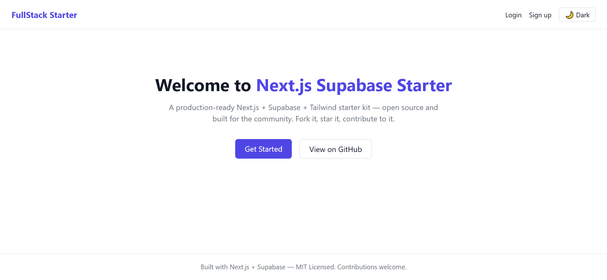
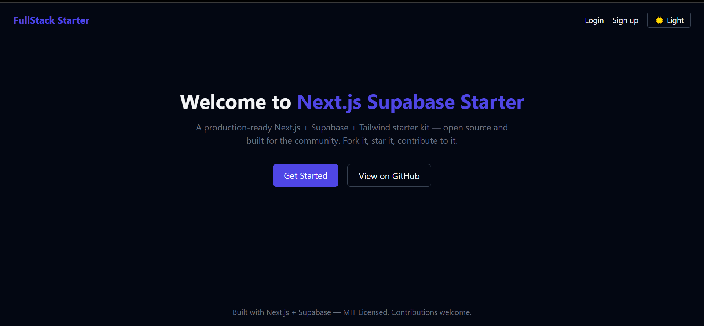
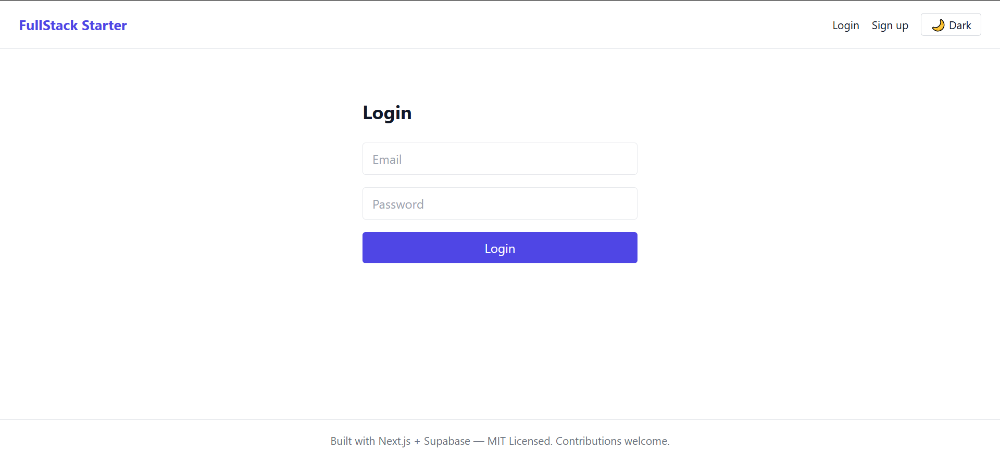
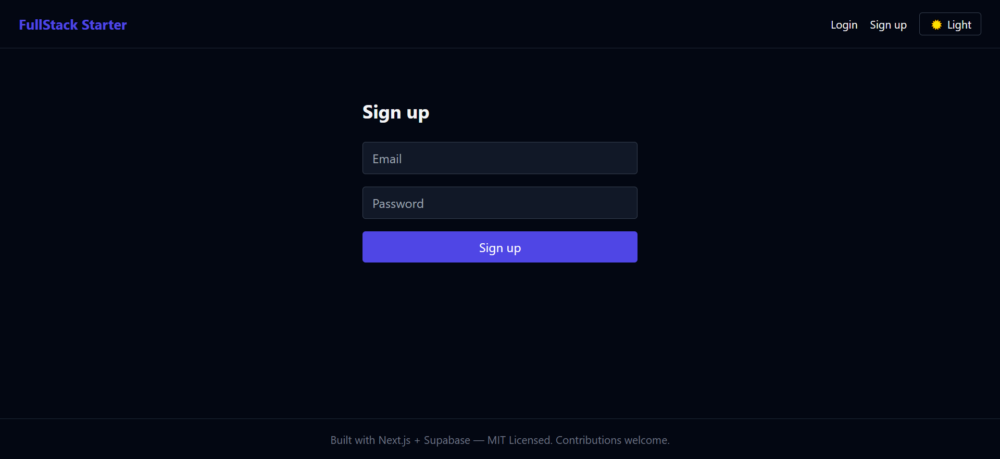

# 🚀 Next.js Supabase Starter — TypeScript + Tailwind

A **production-ready, beginner-friendly, senior-approved** open-source starter kit for building modern SaaS apps fast.


## 📸 Screenshots

| Light Mode | Dark Mode |
|---|---|
|  |  |

| Login | Sign up |
|---|---|
|  |  |

## ✨ Why this repo?

Most starter kits are either too basic (toy examples) or too bloated (locked-in paid templates). This one aims for the middle: **real auth, real database, real dashboard — clean enough to learn from, solid enough to ship.**

Whether you're writing your first PR ever or you're a 10-year senior looking for a well-scoped repo to contribute to on weekends — there's something here for you.

## 🧱 Tech Stack

- [Next.js 14](https://nextjs.org/) (App Router)
- [TypeScript](https://www.typescriptlang.org/)
- [Tailwind CSS](https://tailwindcss.com/)
- [Supabase](https://supabase.com/) (Auth + Postgres DB)

## 📦 Features

- Email/password authentication (Supabase Auth)
- Google OAuth login (Supabase Auth)
- Unit tests with Vitest + Testing Library (`npm test`)
- Protected dashboard route
- Dark mode toggle
- Responsive Navbar/Footer
- Clean folder structure, ready to extend
- GitHub Actions CI (lint on every PR)

## 🏁 Quick Start

```bash
git clone https://github.com/MuhammadNiazAli/nextjs-supabase-starter.git
cd nextjs-supabase-starter
npm install
cp .env.example .env.local
# fill in your Supabase URL + anon key in .env.local
npm run dev
```

Open [http://localhost:3000](http://localhost:3000).

## 🗄️ Supabase Setup

1. Create a free project at [supabase.com](https://supabase.com)
2. Copy your Project URL and anon key into `.env.local`
3. Run `supabase/schema.sql` in the Supabase SQL editor to set up tables

## 🤝 Contributing

This project is built **for the community**. See [CONTRIBUTING.md](./CONTRIBUTING.md) for setup + guidelines.

Look for issues labeled [`good first issue`](../../issues?q=is%3Aissue+is%3Aopen+label%3A%22good+first+issue%22) if you're just starting out, or [`help wanted`](../../issues?q=is%3Aissue+is%3Aopen+label%3A%22help+wanted%22) for meatier features.

Ways to help:
- ⭐ Star the repo
- 🍴 Fork it and experiment
- 🐛 Report bugs via Issues
- 💡 Suggest features
- 🔧 Submit a Pull Request
- 👀 Review open PRs

## 🗺️ Roadmap / Ideas for contributors

- [x] Add Google OAuth login
- [ ] Add GitHub OAuth login
- [ ] Add Stripe billing example
- [x] Add unit tests (Vitest)
- [ ] Add i18n support
- [ ] Add user profile page with avatar upload
- [ ] Add rate limiting on API routes
- [ ] Improve accessibility (a11y audit)
- [ ] Add Storybook for components

## 📄 License

MIT — free to use for personal or commercial projects. See [LICENSE](./LICENSE).

## 🙌 Maintainer

Built by [Muhammad Niaz Ali](https://github.com/MuhammadNiazAli) — full stack developer (Next.js, React Native, Supabase, Python/n8n automation).

If this project helped you, consider giving it a ⭐ it genuinely helps the repo reach more contributors.
